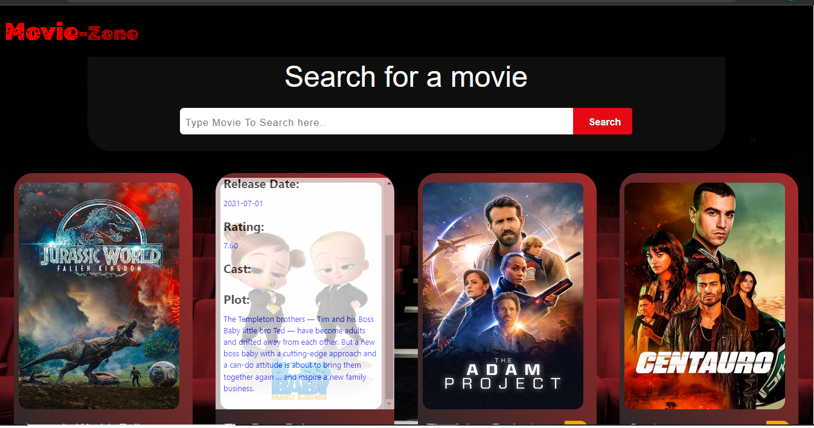
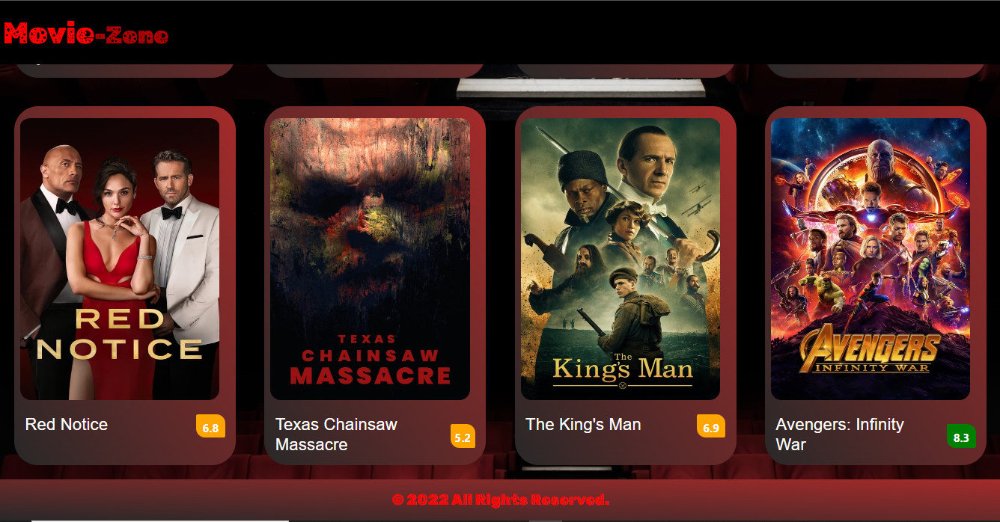
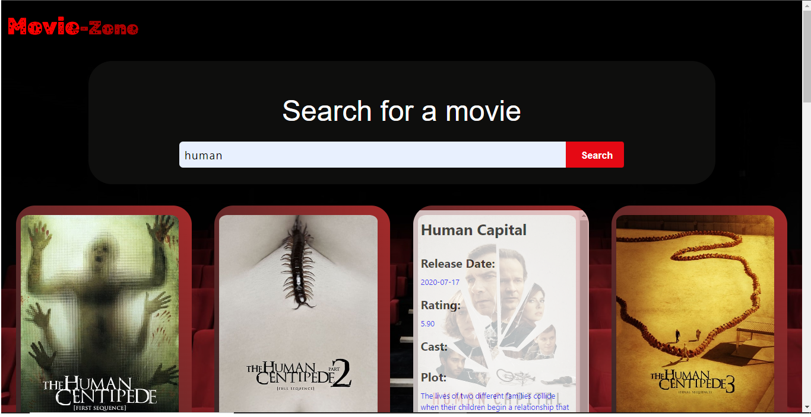

# MOVIE-ZONE
*****
### Author : Kenn Beckloff © 2022
****
## Project Description
Using The Movie Database Api to get list of Movies and reviews that that help movie lovers find a suitable movie to watch depending on the ratings and comments.
******

## Screenshots
 
 
 
 
********
## SetUp Instruction
### Requirements
* [HTML](lang Url)
* Text editor eg [Visual Studio Code](https://code.visualstudio.com/download)

### Getting Files
* Fork the repo
- Create a new branch in your terminal (git checkout -b improve-feature)
- Install the prerequisites
- Make appropriate changes in file(s)
- Run the server to see the changes
- Add the changes and commit them (git commit -am "Improve App")
- Push to the branch (git push origin improve-app)
- Create a Pull request
* Open the folder location on terminal and use the following command to run app:

## How To Run It
Use Live share extension to run the HTML File.
*****
## Live Link
Or you can access the web application directly via this [LINK.]([https://kennbeckloff.github.io/Movie-Zone/])
*****

## Technologies Used
1. HTML
2. CSS
3. JavaScript

*****
## Contact Information
* Email : kennbeckloff688@gmail.com
*****
## [License](LICENSE)
MIT License
Copyright (c) 2022 Kenn Beckloff